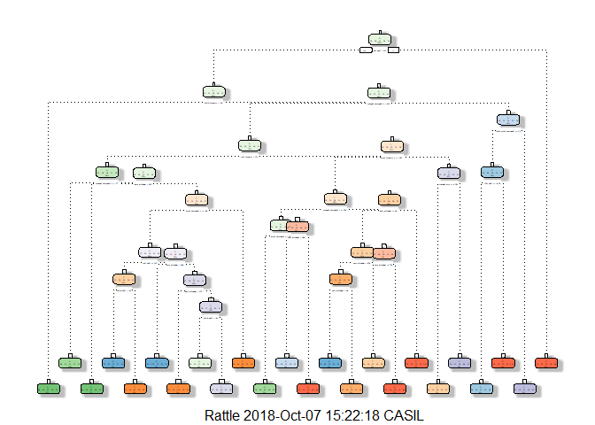

---
title: "ML project"
author: "OS"
date: "October 7, 2018"
output:
  html_document:
    keep_md: true
---
#Coursera - Practical Machine Learning Project

One thing that people regularly do is quantify how much of a particular activity they do, but they rarely quantify how well they do it. In this project, my goal will be to use data from accelerometers on the belt, forearm, arm, and dumbell of 6 participants, to predict the manner in which they did the exercise

##Set up the libraries

```r
library(caret)
```

```
## Loading required package: lattice
```

```
## Loading required package: ggplot2
```

```r
library(randomForest)
```

```
## randomForest 4.6-14
```

```
## Type rfNews() to see new features/changes/bug fixes.
```

```
## 
## Attaching package: 'randomForest'
```

```
## The following object is masked from 'package:ggplot2':
## 
##     margin
```

```r
library(rattle)
```

```
## Rattle: A free graphical interface for data science with R.
## Version 5.2.0 Copyright (c) 2006-2018 Togaware Pty Ltd.
## Type 'rattle()' to shake, rattle, and roll your data.
```

```
## 
## Attaching package: 'rattle'
```

```
## The following object is masked from 'package:randomForest':
## 
##     importance
```

```r
library(e1071) 
library(rpart)
library(gbm)
```

```
## Loaded gbm 2.1.4
```

##Load the data

```r
train_data<-read.csv("pml-training.csv", header = TRUE)
test_data<-read.csv("pml-testing.csv", header = TRUE)
```
create a new partition

```r
to_part  <- createDataPartition(train_data$classe, p=0.7, list=FALSE)
train2_data <- train_data[to_part, ]
test2_data <- train_data[-to_part, ]
```

##Explore and clean the data

There are columns that are mostly empty, I will remove them for the data. I will also remove identification only variables (columns 1 to 7)


```r
data_remove <- sapply(train2_data, function(x) mean(is.na(x))) > 0.90
train2_data <- train2_data[, data_remove==FALSE]
test2_data  <- test2_data[, data_remove==FALSE]
zero <- nearZeroVar(train2_data)
train2_data <- train2_data[, -zero]
test2_data  <- test2_data[, -zero]
train2_data <- train2_data[, -(1:5)]
test2_data <- test2_data[, -(1:5)]
```

##Prediction

###Random forest


```r
set.seed(12345)
controlRF <- trainControl(method="cv", number=3, verboseIter=FALSE)
modFitRandForest <- train(classe ~ ., data=train2_data, method="rf",
                          trControl=controlRF)
modFitRandForest$finalModel
```

```
## 
## Call:
##  randomForest(x = x, y = y, mtry = param$mtry) 
##                Type of random forest: classification
##                      Number of trees: 500
## No. of variables tried at each split: 27
## 
##         OOB estimate of  error rate: 0.25%
## Confusion matrix:
##      A    B    C    D    E  class.error
## A 3904    1    0    0    1 0.0005120328
## B    7 2645    6    0    0 0.0048908954
## C    0    5 2391    0    0 0.0020868114
## D    0    0   10 2241    1 0.0048845471
## E    0    0    0    3 2522 0.0011881188
```

We will use it with the test dataset


```r
predictRF <- predict(modFitRandForest, newdata=test2_data)
confMatRF <- confusionMatrix(predictRF, test2_data$classe)
confMatRF
```

```
## Confusion Matrix and Statistics
## 
##           Reference
## Prediction    A    B    C    D    E
##          A 1674    3    0    0    0
##          B    0 1134    2    0    0
##          C    0    1 1024    4    0
##          D    0    1    0  960    4
##          E    0    0    0    0 1078
## 
## Overall Statistics
##                                           
##                Accuracy : 0.9975          
##                  95% CI : (0.9958, 0.9986)
##     No Information Rate : 0.2845          
##     P-Value [Acc > NIR] : < 2.2e-16       
##                                           
##                   Kappa : 0.9968          
##  Mcnemar's Test P-Value : NA              
## 
## Statistics by Class:
## 
##                      Class: A Class: B Class: C Class: D Class: E
## Sensitivity            1.0000   0.9956   0.9981   0.9959   0.9963
## Specificity            0.9993   0.9996   0.9990   0.9990   1.0000
## Pos Pred Value         0.9982   0.9982   0.9951   0.9948   1.0000
## Neg Pred Value         1.0000   0.9989   0.9996   0.9992   0.9992
## Prevalence             0.2845   0.1935   0.1743   0.1638   0.1839
## Detection Rate         0.2845   0.1927   0.1740   0.1631   0.1832
## Detection Prevalence   0.2850   0.1930   0.1749   0.1640   0.1832
## Balanced Accuracy      0.9996   0.9976   0.9985   0.9974   0.9982
```

###Decision Trees

```r
set.seed(12345)
modFitDT <- rpart(classe ~ ., data=train2_data, method="class")
fancyRpartPlot(modFitDT)
```

```
## Warning: labs do not fit even at cex 0.15, there may be some overplotting
```

<!-- -->

We will use it with the test dataset


```r
predictDT <- predict(modFitDT, newdata=test2_data, type="class")
confMatDT <- confusionMatrix(predictDT, test2_data$classe)
confMatDT
```

```
## Confusion Matrix and Statistics
## 
##           Reference
## Prediction    A    B    C    D    E
##          A 1513  245   44   95   60
##          B   47  595   33   59   42
##          C   12  150  880   99   20
##          D   98  134   69  690  143
##          E    4   15    0   21  817
## 
## Overall Statistics
##                                           
##                Accuracy : 0.7638          
##                  95% CI : (0.7527, 0.7746)
##     No Information Rate : 0.2845          
##     P-Value [Acc > NIR] : < 2.2e-16       
##                                           
##                   Kappa : 0.6999          
##  Mcnemar's Test P-Value : < 2.2e-16       
## 
## Statistics by Class:
## 
##                      Class: A Class: B Class: C Class: D Class: E
## Sensitivity            0.9038   0.5224   0.8577   0.7158   0.7551
## Specificity            0.8946   0.9619   0.9422   0.9098   0.9917
## Pos Pred Value         0.7731   0.7668   0.7580   0.6085   0.9533
## Neg Pred Value         0.9590   0.8935   0.9691   0.9423   0.9473
## Prevalence             0.2845   0.1935   0.1743   0.1638   0.1839
## Detection Rate         0.2571   0.1011   0.1495   0.1172   0.1388
## Detection Prevalence   0.3325   0.1319   0.1973   0.1927   0.1456
## Balanced Accuracy      0.8992   0.7421   0.8999   0.8128   0.8734
```

##Generalized Boosted Model
This will be the last method to test

```r
set.seed(12345)
controlGBM <- trainControl(method = "repeatedcv", number = 5, repeats = 1)
modFitGBM  <- train(classe ~ ., data=train2_data, method = "gbm",
                    trControl = controlGBM, verbose = FALSE)
modFitGBM$finalModel
```

```
## A gradient boosted model with multinomial loss function.
## 150 iterations were performed.
## There were 53 predictors of which 41 had non-zero influence.
```

Now it is time to predict


```r
predictGBM <- predict(modFitGBM, newdata=test2_data)
confMatGBM <- confusionMatrix(predictGBM, test2_data$classe)
confMatGBM
```

```
## Confusion Matrix and Statistics
## 
##           Reference
## Prediction    A    B    C    D    E
##          A 1671    6    0    0    0
##          B    3 1112    7    5    3
##          C    0   20 1018   14    2
##          D    0    1    1  944   13
##          E    0    0    0    1 1064
## 
## Overall Statistics
##                                           
##                Accuracy : 0.9871          
##                  95% CI : (0.9839, 0.9898)
##     No Information Rate : 0.2845          
##     P-Value [Acc > NIR] : < 2.2e-16       
##                                           
##                   Kappa : 0.9837          
##  Mcnemar's Test P-Value : NA              
## 
## Statistics by Class:
## 
##                      Class: A Class: B Class: C Class: D Class: E
## Sensitivity            0.9982   0.9763   0.9922   0.9793   0.9834
## Specificity            0.9986   0.9962   0.9926   0.9970   0.9998
## Pos Pred Value         0.9964   0.9841   0.9658   0.9844   0.9991
## Neg Pred Value         0.9993   0.9943   0.9983   0.9959   0.9963
## Prevalence             0.2845   0.1935   0.1743   0.1638   0.1839
## Detection Rate         0.2839   0.1890   0.1730   0.1604   0.1808
## Detection Prevalence   0.2850   0.1920   0.1791   0.1630   0.1810
## Balanced Accuracy      0.9984   0.9863   0.9924   0.9881   0.9916
```

##Select the model

Random Forests gave an Accuracy of  99,66%, which was more accurate that what I got from the Decision Trees (74,72%) or GBM (98,56%)


```r
predictTEST <- predict(modFitRandForest, newdata=test_data)
predictTEST
```

```
##  [1] B A B A A E D B A A B C B A E E A B B B
## Levels: A B C D E
```

